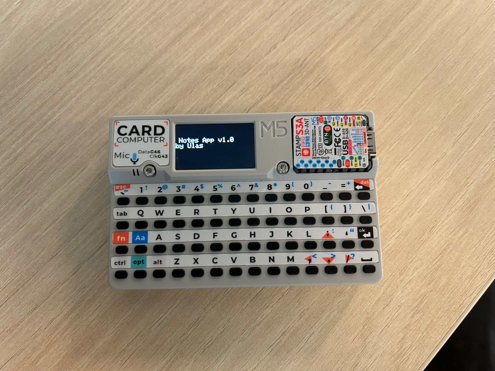

# 📝 Cardputer Notes App 

A small Notes app for the **M5Stack Cardputer (ESP32‑S3)**.  
Currently supports a menu, creating notes (stored in RAM), and an About screen.

---

## ✅ Current Features
- **Menu** with 3 options (New Note, View Notes, About)
- **New Note** screen
  - Type text smoothly with `M5Canvas`
  - **Enter** saves the note (in memory)
  - **` (backtick)** returns to menu
- **About** screen with version info

---

## ⚠️ Limitations
- Notes are not persistent (lost on reset)
- No backspace support yet
- View Notes is not implemented

---

## 🗂️ PlatformIO `platformio.ini`
```ini
[env:m5stack-stamp-s3]
platform = espressif32
board = esp32-s3-devkitc-1
framework = arduino
upload_speed = 1500000
build_flags = 
    -DESP32S3
    -DCORE_DEBUG_LEVEL=5
    -DARDUINO_USB_CDC_ON_BOOT=1
    -DARDUINO_USB_MODE=1
lib_deps = 
    M5Unified=https://github.com/m5stack/M5Unified
    m5stack/M5GFX@^0.2.9
    m5stack/M5Unified@^0.2.7
    m5stack/M5Cardputer@^1.0.3
```

---

## 🎮 Controls
### The cardputer is controlled through the built-in keyboard
- `1` = New Note
- `2` = View Notes 
- `3` = About
- **Enter** = Save note
- **ESC** = Return to menu


---
