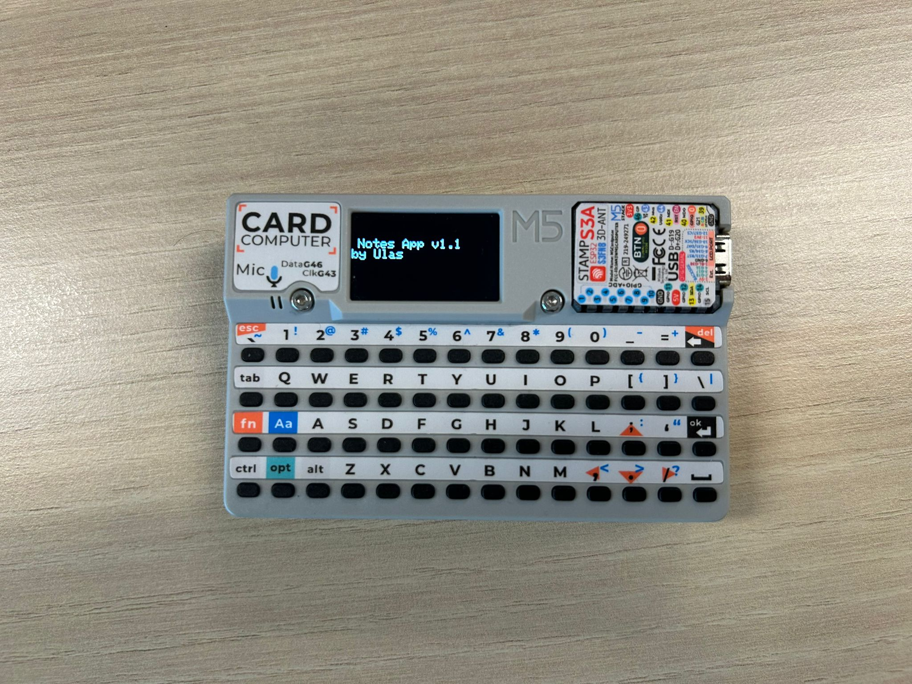

# 📝 Cardputer Notes App

A lightweight **Notes application** for the [M5Stack Cardputer (ESP32-S3)](https://shop.m5stack.com/products/m5stack-cardputer-kit-w-m5stamps3).  
It provides a simple way to create, edit, and view text notes directly on the device.

---

## ✨ Features
- **Menu navigation**
  - Options: *New Note*, *View Notes*, *About*
- **Persistent storage**
  - Notes saved to the SD card (`/note1.txt`, `/note2.txt`, …)  
  - Survive resets and power-off
- **New Note editor**
  - Smooth text input with `M5Canvas`
  - Blinking cursor for clear typing feedback
  - Supports **backspace** and **delete**
- **Edit existing notes**
  - Open notes from the list and continue editing
- **View Notes list**
  - Scroll through saved notes easily
  - Highlighted selection window for navigation
- **About screen**
  - Displays app version & author

---

## ⚙️ Requirements
- **Hardware**
  - M5Stack Cardputer (ESP32-S3)
  - microSD card (FAT32)
- **Libraries**
  - [M5Unified](https://github.com/m5stack/M5Unified)  
  - [M5Cardputer](https://github.com/m5stack/M5Cardputer)  
  - [M5GFX](https://github.com/m5stack/M5GFX)  

---

## ▶️ Usage
1. Insert a microSD card into the Cardputer.  
2. Flash the firmware with [PlatformIO](https://platformio.org/).  
3. On boot, the **Menu** is shown:
   - `1` → New Note  
   - `2` → View Notes  
   - `3` → About  
4. In *New Note*:
   - Type to add text.  
   - `Enter` saves to SD card.  
   - Backspace/Delete supported.  
   - Press backtick (\`) to return to the menu.
5. In *View Notes*:
   - Use arrow keys to scroll.  
   - Press `Enter` to edit a selected note.
   - Press `delete` to remove an existing note.

---

## 📷 Screenshot


---

## 📂 PlatformIO `platformio.ini`

```ini

[env:cardputer]
platform = espressif32
board = esp32-s3-devkitc-1
framework = arduino
upload_speed = 1500000
monitor_speed = 115200
build_flags = 
    -DESP32S3
    -DCORE_DEBUG_LEVEL=5
    -DARDUINO_USB_CDC_ON_BOOT=1
    -DARDUINO_USB_MODE=1
lib_deps = 
    m5stack/M5Cardputer@^1.0.3
    m5stack/M5GFX@^0.2.9
    m5stack/M5Unified@^0.2.7
```
